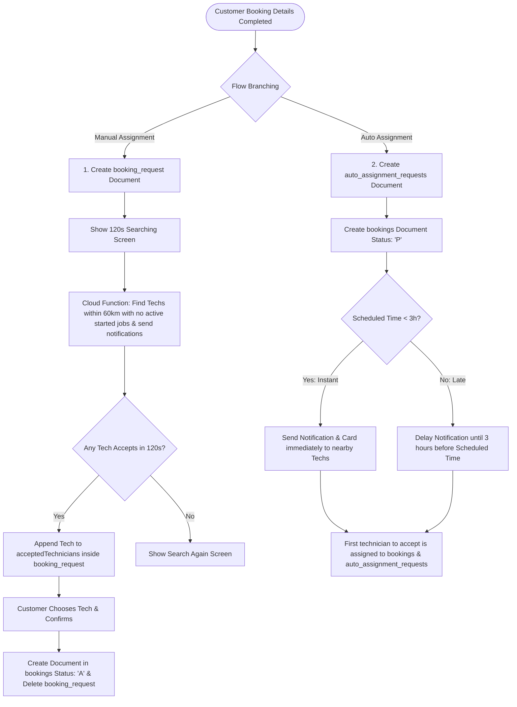

# ABO Glumbo Booking Workflow Updates

This implementation plan details the architectural and code-level updates required to introduce the new booking workflows across the **ABO Glumbo** ecosystem (Customer App, Technician App, and Firebase Backend).

---

## 1. Goal Description & Workflow Architecture

The updated system will split bookings into two core flows—**Manual Assignment** and **Auto Assignment**—based on the current date, work hours of the selected service, and the chosen booking time.



### Manual Assignment Flow
* **Branching Rule**: Triggered when:
  * **Service Now** (is always on-hours since off-hours are blocked in step 1), OR
  * **Service Later** scheduled for **Today** (on-hours or off-hours), OR
  * **Service Later** scheduled for a **Future Day** on-hours.
* **Process**:
  1. Customer fills out problem description, uploads images/videos, and clicks "Continue".
  2. A document is added to the new `booking_request` collection (doc ID = `bookingId`).
  3. The customer is immediately shown the **Searching for Technicians** screen with a **120-second timer**.
  4. Backend triggers and notifies eligible technicians (proximity within 60km, no active started jobs).
  5. Eligible technicians see a card with a 120s countdown in their **Pending** tab.
  6. Any technician who accepts is added to the `acceptedTechnicians` list in the `booking_request` document. The customer receives a push notification on each acceptance.
  7. If no one accepts in 120s, the customer is shown the **Search Again** screen (which deletes the `booking_request` and resets).
  8. If they background/close the app and return within 5 minutes, they continue from the searching screen (showing any accepted technicians). If they return after 5 minutes, they are directed to the **Search Again** screen.
  9. Customer selects a technician, completes payment/confirmation, creating the full booking in `bookings` collection with status `'A'`, and the `booking_request` is deleted.

### Auto Assignment Flow
* **Branching Rule**: Triggered when:
  * **Service Later** scheduled for a **Future Day** off-hours.
* **Process**:
  1. A document is added to `auto_assignment_requests` (doc ID = `bookingId`).
  2. A booking document is added to `bookings` with status `'P'` (Pending) and no technician.
  3. **Instant Auto-Assignment** (Scheduled time is within 3 hours from booking): Notify eligible technicians immediately. First to accept is assigned.
  4. **Late Auto-Assignment** (Scheduled time is > 3 hours from booking): Hold notifications. Proximity search and notifications trigger exactly **3 hours before scheduled time**. First to accept is assigned.

---

## User Review Required

> [!IMPORTANT]
> **Push Notifications Lifecycle**
> * For the Customer App, notifications must navigate the user to the active **Searching / Selection** screen if the booking request is still active.
> * For the Technician App, push notifications will open the app directly to the **Orders Page (Pending Tab)**, which streams the active job offers.

> [!WARNING]
> **Proximity Accuracy**
> * Proximity relies on `technician.lastKnownLocation` being updated recently. If the technician's location data is stale, they might miss job offers or receive offers further than 60km away.

---

## Open Questions

> [!IMPORTANT]
> 1. Should we automatically cancel or delete a `booking_request` if the customer explicitly leaves the searching screen by pressing back/cancel, or only when the timer expires? (We plan to delete it on manual cancel/back button press to keep database tidy).
> 2. For the 5-minute resume timeout: Is checking `now - bookingRequest.createdAt < 5 minutes` sufficient, or would you prefer a local database timer? (We will compare `DateTime.now()` with `bookingRequest.createdAt` dynamically from Firestore).

---

## Proposed Changes

### 1. Firestore Database Schema [NEW]

We will create two new top-level collections in Firestore.

#### Collection: `booking_request`
```json
{
  "id": "booking_id_123",
  "service": { ...ServiceModel... },
  "bookingDateTime": "Timestamp",
  "notes": "Problem description text",
  "issueImage": "https://storage.googleapis/...jpg",
  "issueVideo": "https://storage.googleapis/...mp4",
  "customer": { ...CustomerModel... },
  "paymentModeCode": "O",
  "selectedAddressId": "address_id_abc",
  "isOnHour": true,
  "serviceLocation": { ...MatchedServiceZone... },
  "createdAt": "Timestamp",
  "updatedAt": "Timestamp",
  "status": "searching", // "searching" | "completed" | "expired"
  "acceptedTechnicians": [
    {
      "uid": "tech_uid_789",
      "name": "John Doe",
      "phone": "+966500000000",
      "profileUrl": "https://...",
      "rating": 4.8,
      "completedJobs": 24,
      "acceptedAt": "Timestamp"
    }
  ],
  "rejectedTechnicians": ["tech_uid_456"]
}
```

#### Collection: `auto_assignment_requests`
```json
{
  "id": "booking_id_456",
  "service": { ...ServiceModel... },
  "bookingDateTime": "Timestamp",
  "notes": "Problem description",
  "issueImage": "",
  "issueVideo": "",
  "customer": { ...CustomerModel... },
  "paymentModeCode": "O",
  "selectedAddressId": "address_id_xyz",
  "isOnHour": false,
  "serviceLocation": { ...MatchedServiceZone... },
  "createdAt": "Timestamp",
  "updatedAt": "Timestamp",
  "status": "P",
  "type": "instant", // "instant" | "late"
  "notificationSent": false,
  "agent": null // Set once accepted
}
```

---

### 2. Backend Cloud Functions (`abo_glumbo_technician_bbk`)

We will implement three new highly robust backend triggers in `functions/index.js` using v2 Firebase Functions:

#### [MODIFY] [index.js](file:///c:/Hansuke/Work/abo_glumbo_technician_bbk/functions/index.js)
* **`onBookingRequestCreated`**:
  * Triggers when `booking_request/{requestId}` is created.
  * Queries all `users` with role `"agent"`, `isOnline == true`, and `isVerified == true`.
  * Filters agents:
    1. Distance: Uses spherical geometry to ensure agent's `lastKnownLocation` is within 60km of `booking_request` customer location.
    2. Availability: Queries `bookings` collection to ensure agent has no active booking in status `'A'` with `trackingStartedAt != null` and `completedAt == null`.
  * For each eligible agent, creates a document in `job_offers` with `status: 'pending'`, `bookingId`, `expiresAt: now + 120 seconds`.
  * Sends an FCM push notification: "New Job Offer Available" to each eligible technician.
* **`onJobOfferUpdated`**:
  * Triggers when `job_offers/{offerId}` is updated.
  * If status is updated to `'accepted_by_technician'`:
    * Append the technician's details into the corresponding `booking_request`'s `acceptedTechnicians` array.
    * Send an FCM notification to the customer: "A technician has accepted your request, review and choose a technician."
  * If status is updated to `'declined'`:
    * Append the technician's `uid` to the `booking_request`'s `rejectedTechnicians` array.
* **`processAutoAssignments`**:
  * Run as a scheduled cron job (every 5 minutes).
  * Queries `auto_assignment_requests` where `type == 'late'`, `status == 'P'`, and `notificationSent == false`.
  * Triggers proximity check and notifies eligible technicians if current time is within **3 hours** of `bookingDateTime`. Sets `notificationSent = true`.

---

### 3. Customer App (`abo_glumbo_bkk`)

#### [MODIFY] [collections.dart](file:///c:/Hansuke/Work/abo_glumbo_bkk/lib/helpers/collections.dart)
* Add static collection references for `bookingRequestsCollectionRef` and `autoAssignmentRequestsCollectionRef`.

#### [MODIFY] [save_booking.dart](file:///c:/Hansuke/Work/abo_glumbo_bkk/lib/services/booking/save_booking.dart)
* Update `saveBooking` method or add specialized handlers to save bookings using the branching logic:
  * For manual assignment, write to `booking_request` collection and return the request ID.
  * For auto assignment, write both to `bookings` (status `'P'`, agent `null`) and `auto_assignment_requests` collections.

#### [MODIFY] [book_service_page.dart](file:///c:/Hansuke/Work/abo_glumbo_bkk/lib/pages/bookings/book_service_page.dart)
* Update continue handler in Step 1 (Details / Problem Description screen) to:
  * Determine flow type (Manual vs Auto).
  * If **Auto Assignment**: Create `auto-assignment_requests` + standard booking, then navigate to auto-assignment confirmation page.
  * If **Manual Assignment**: Create `booking_request` and push the new `SearchingTechniciansScreen` with 120s timer.

#### [NEW] [searching_technicians_screen.dart](file:///c:/Hansuke/Work/abo_glumbo_bkk/lib/pages/bookings/searching_technicians_screen.dart)
* Visual searching overlay/screen containing:
  * A 120s countdown progress circle.
  * Real-time Firestore stream listener on `booking_request/{requestId}`.
  * Shows list of accepted technicians (from `acceptedTechnicians` list) dynamically as they accept.
  * Standardized selection cards displaying tech name, photo, rating, completed orders, and proximity.
  * Confirmation button that converts selection to `bookings` document, sets status `'A'`, deletes the `booking_request`, and redirects to Success.
  * "Search Again" UI shown if timer expires with 0 accepted techs or manually requested.

#### [MODIFY] [home.dart](file:///c:/Hansuke/Work/abo_glumbo_bkk/lib/pages/home.dart) (or customer home screen)
* Read active booking requests from Firestore for the logged-in customer.
* If a request is active (createdAt within the last 5 minutes), show a beautiful, high-priority home screen card: **"Continue your booking"**.
* Clicking the card directs the customer back to the `SearchingTechniciansScreen`.

---

### 4. Technician App (`abo_glumbo_technician_bbk`)

#### [MODIFY] [firestore.dart](file:///c:/Hansuke/Work/abo_glumbo_technician_bbk/lib/helpers/firestore.dart)
* Add static reference to `bookingRequestsCollectionRef` and `autoAssignmentRequestsCollectionRef`.

#### [MODIFY] [worker_home.dart](file:///c:/Hansuke/Work/abo_glumbo_technician_bbk/lib/pages/home/worker/worker_home.dart)
* Verify that `getJobOffersStream` correctly processes offers pointing to the new `booking_request` collection when the notification is tapped.
* Verify the "Pending Acceptance" or "Awaiting Customer Action" labels display correctly when offer status is updated to `'accepted_by_technician'`.

#### [MODIFY] [booking_cards.dart](file:///c:/Hansuke/Work/abo_glumbo_technician_bbk/lib/common_widget/booking_cards.dart)
* Ensure `JobOfferTileWidget` accept/reject triggers the updated offer workflow seamlessly.

---

## Verification Plan

### Automated Verification
* Execute backend tests to ensure distance calculations (60km limits) and active started booking checks filter correct technician lists.
* Run Flutter analyzer on both codebases:
  ```bash
  flutter analyze
  ```

### Manual Verification
1. **Manual Assignment Testing**:
   * Create a normal booking during working hours.
   * Verify that the app transitions to the "Searching for Technicians" screen with a 120s timer.
   * Verify that the backend function triggers and adds a `job_offer` for the technician within 60km.
   * Verify technician receives a push notification, taps it, accepts the booking request, and is shown as "Awaiting Customer Action" in their Pending tab.
   * Verify customer receives a notification that the technician has accepted, sees the technician card in the list, selects them, and the booking finishes as status `'A'`.
2. **Auto Assignment Testing**:
   * Schedule a Service Later booking off-hours on a future day.
   * Verify that the booking enters `'P'` (Pending) status with no agent.
   * Trigger the auto assignment cron function and verify notifications are sent to technicians exactly 3 hours before appointment scheduled time.
3. **App Backgrounding/Resumption**:
   * Start manual searching, background the customer app, and return within 5 minutes. Verify search state and accepted technicians are preserved.
   * Background the app and return after 5 minutes. Verify that the "Search Again" screen is presented.
